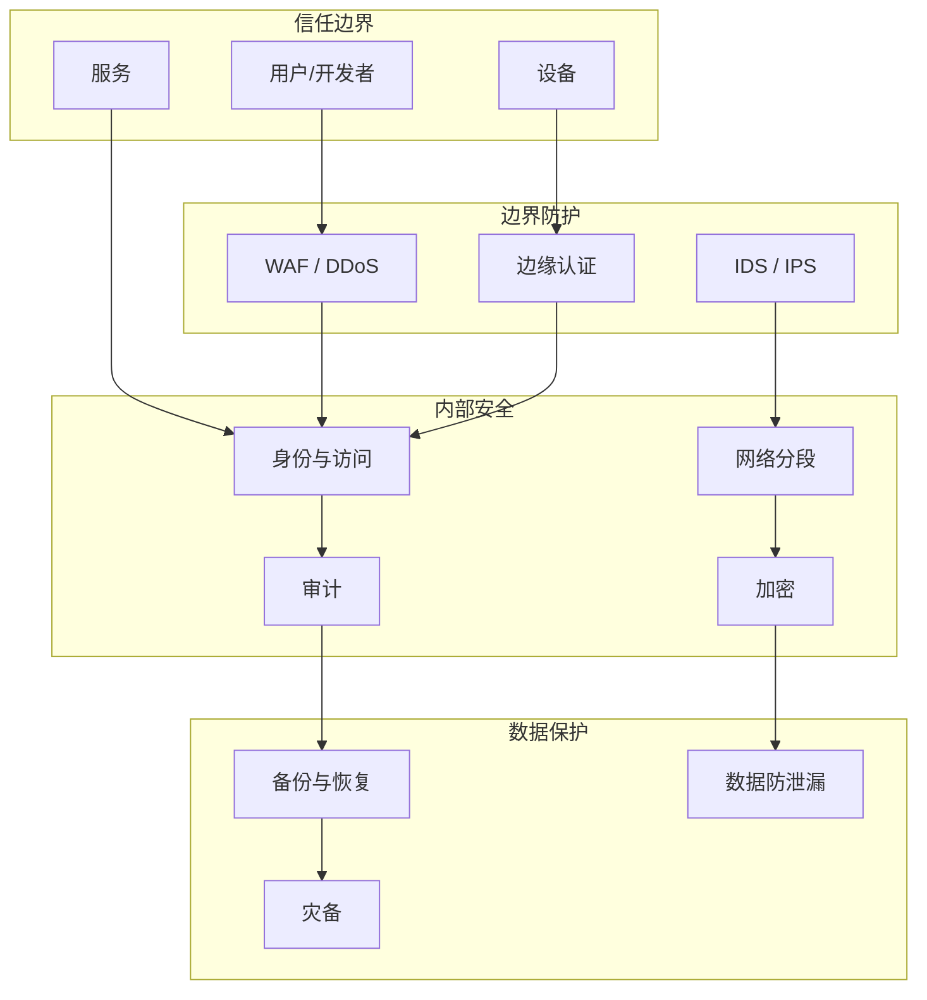
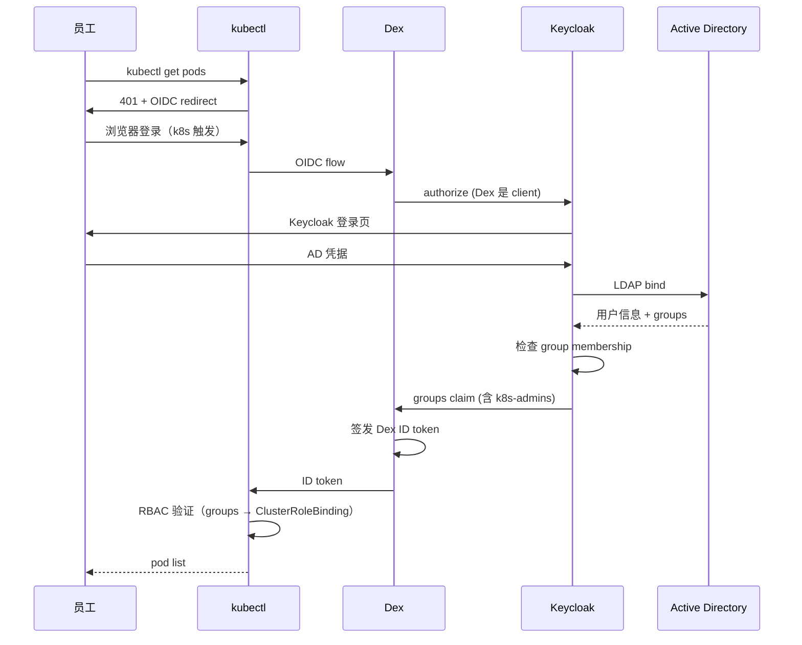
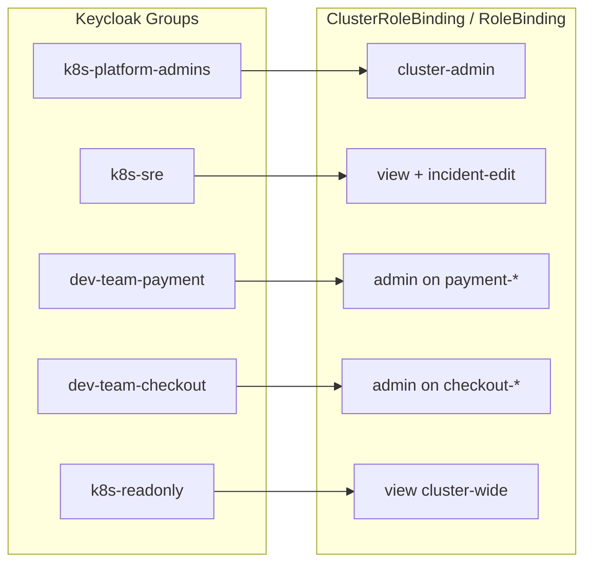
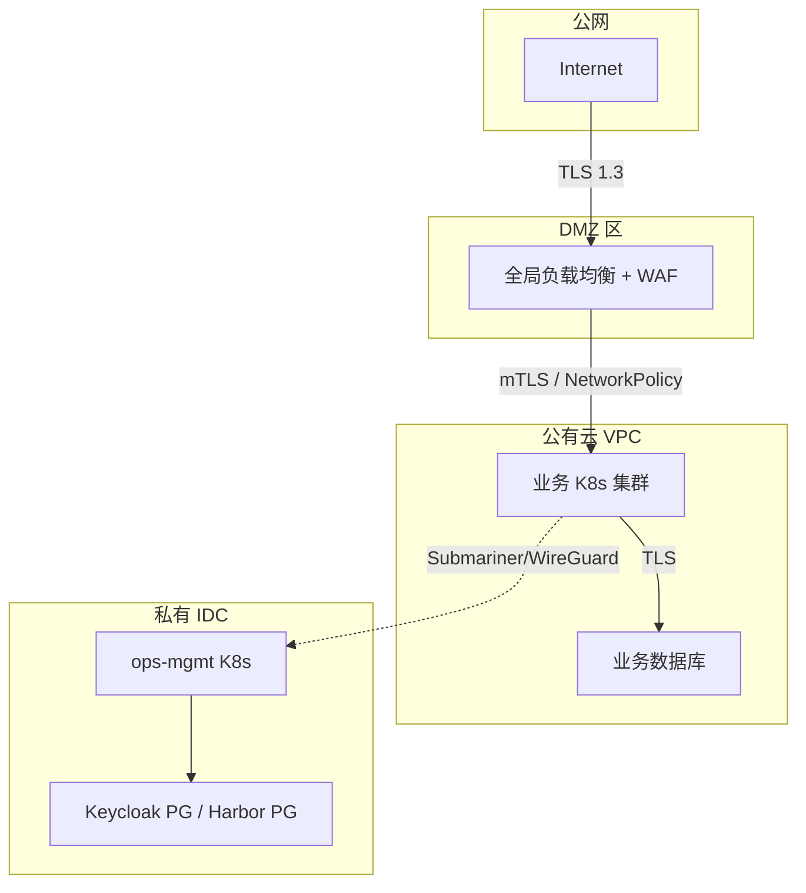
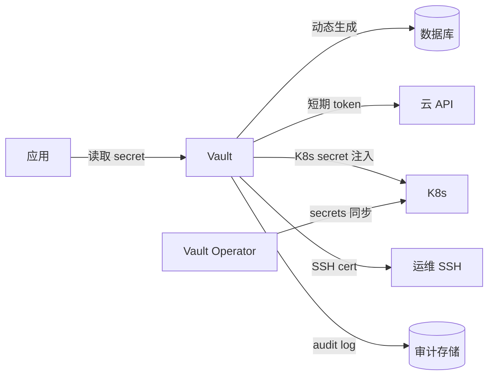
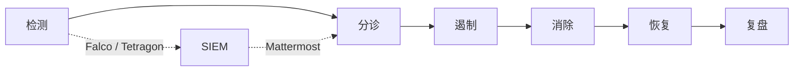

# 安全模型详细设计

> 范围：OpsHub 平台的安全体系，覆盖身份、认证、授权、加密、审计、供应链。
> 适用：v1.0（2026-09）
> 前置：[02-架构设计.md](02-架构设计.md)

---

## 1. 安全总览



---

## 2. 零信任原则

OpsHub 采用**零信任（Zero Trust）**安全模型：

1. **Never trust, always verify**：每次访问都要验证身份，不依赖网络位置
2. **Least privilege**：每个用户/服务只给最小必需权限
3. **Assume breach**：假设边界已被攻破，内部仍要分段隔离
4. **Verify explicitly**：基于身份、设备、行为等多维度判定
5. **Continuous validation**：会话期间持续验证，不是一次性

---

## 3. 身份认证

### 3.1 身份源

| 身份源 | 用途 | 同步方式 |
|---|---|---|
| Active Directory | 员工主账号 | LDAP federation（Keycloak） |
| LDAP | 传统业务系统 | LDAP federation |
| GitHub Enterprise | 开发者 Git 操作 | OIDC federation |
| Service Account (Vault) | 工作负载身份 | 短期 token 签发 |

### 3.2 认证流程



### 3.3 多因素认证（MFA）

| 场景 | MFA 强制 | 方式 |
|---|---|---|
| 平台管理员登录 | 强制 | TOTP / WebAuthn |
| 业务开发者登录 | 强制 | TOTP |
| 服务账号 | N/A | 用短期 token |
| break-glass 账号 | 强制 | 硬件 key |

### 3.4 凭证强度

- 密码：12+ 字符、含大小写+数字+符号
- Session：1 小时强制重新登录
- 短期 token：OIDC ID Token 1 小时，Refresh Token 7 天
- 离线 break-glass：硬件 key + 加密密码信封

---

## 4. 授权（RBAC）

### 4.1 K8s RBAC 模型



### 4.2 默认拒绝 + 显式允许

所有 namespace 默认：
- `NetworkPolicy: default deny all`（拒绝所有进出）
- `PodSecurity: restricted`（拒绝特权容器）
- `LimitRange`（资源限制）
- `ResourceQuota`（总资源限制）

### 4.3 业务命名空间 RBAC 模板

```yaml
# 业务团队 onboarding 模板
apiVersion: v1
kind: Namespace
metadata:
  name: payment-team
  labels:
    team: payment
    tier: "1"
    pod-security.kubernetes.io/enforce: restricted
---
apiVersion: networking.k8s.io/v1
kind: NetworkPolicy
metadata:
  name: default-deny
  namespace: payment-team
spec:
  podSelector: {}
  policyTypes: [Ingress, Egress]
---
# RoleBinding: 业务团队可管理自己 ns
apiVersion: rbac.authorization.k8s.io/v1
kind: RoleBinding
metadata:
  name: payment-team-admin
  namespace: payment-team
subjects:
- kind: Group
  name: dev-team-payment
  apiGroup: rbac.authorization.k8s.io
roleRef:
  kind: ClusterRole
  name: admin
  apiGroup: rbac.authorization.k8s.io
```

### 4.4 紧急访问（Break Glass）

正常流程外，需要紧急访问（如 keycloak 故障、群组配置错误）：

1. **预置 break-glass 账号**：硬件 key + 加密密码信封，存在保险柜
2. **生成短期 kubeconfig**：用 24h 过期 client cert
3. **必须 2 人到场**：1 个有 break-glass + 1 个 witness
4. **所有操作审计**：K8s audit log 必须开到 `RequestResponse` 级别
5. **事后 review**：24h 内必须做 incident review

---

## 5. 网络安全

### 5.1 网络分段



### 5.2 防火墙规则（最小白名单）

| 源 | 目标 | 端口 | 协议 | 用途 |
|---|---|---|---|---|
| 业务 Pod | 业务 DB | 5432 | TCP | PostgreSQL |
| 业务 Pod | S3 兼容存储 | 443 | TCP | 对象存储 |
| 业务集群 metrics | ops-mgmt Prometheus | 9090, 9091 | TCP | 指标抓取 |
| 业务 Pod 日志 | ops-mgmt Loki | 3100 | TCP | 日志推送 |
| 业务 Pod traces | ops-mgmt Tempo | 4317 | TCP | OTLP gRPC |
| ops-mgmt | 业务 K8s API | 6443 | TCP | ArgoCD 拉集群 |
| 业务 K8s API | Dex | 5556 | TCP | OIDC discovery |
| Dex | Keycloak | 8443 | TCP | OIDC federation |
| Harbor 主 | Harbor 副本 | 443 | TCP | 镜像复制 |
| ops-mgmt | 公有云 API | 443 | TCP | Cluster API |
| Submariner gateway | Submariner gateway | 4500/UDP, 4490/UDP | UDP | WireGuard/IPSec |

**默认拒绝**所有其他端口。

### 5.3 mTLS 服务网格

所有内部服务通信用 mTLS（Istio 或 Linkerd）：

```yaml
# Istio PeerAuthentication（强制 mTLS）
apiVersion: security.istio.io/v1beta1
kind: PeerAuthentication
metadata:
  name: default
  namespace: istio-system
spec:
  mtls:
    mode: STRICT
```

### 5.4 Egress 控制

业务 Pod 默认**禁止**出公网。需要访问外部 API 时：

1. 创建 `EgressGateway` 审批单
2. 安全团队 review 目标域名
3. Kyverno 策略允许该 namespace 走 EgressGateway
4. 所有外部访问记录在 Cilium Hubble

---

## 6. 数据保护

### 6.1 加密（in-transit + at-rest）

| 数据 | 加密 | 实现 |
|---|---|---|
| 南北向流量 | TLS 1.3 | GLB / Ingress cert |
| 集群内服务通信 | mTLS | Istio |
| 跨集群通信 | WireGuard / IPSec | Submariner |
| 持久卷 (云) | 云厂商 KMS | 块存储加密 |
| 持久卷 (本地) | LUKS | 物理机本地盘 |
| 备份 (S3) | SSE-KMS | 跨 region 复制 |
| 数据库 | TDE / 字段加密 | 应用层 + DB 层 |
| 配置文件 | Sealed Secrets / Vault | K8s 部署 |
| 日志 | TLS push | Promtail / Vector |
| 指标 | TLS scrape | Prometheus |

### 6.2 密钥管理



**Vault 部署**：
- 私有 IDC，3 节点 HA（Integrated Raft 存储）
- Auto-unseal 用云厂商 KMS
- 每季度演练 unseal 流程
- 离线 unseal key 分 3 份给 3 个高管

### 6.3 数据分类

| 级别 | 例子 | 加密要求 | 访问审计 |
|---|---|---|---|
| L4 绝密 | 用户密码、密钥材料 | 字段级加密 + 硬件 HSM | 每次访问 |
| L3 机密 | 用户隐私数据、财务数据 | 表级加密 | 每次访问 |
| L2 受限 | 业务数据 | 传输加密 | 每日聚合 |
| L1 公开 | 文档、代码 | 传输加密 | 不要求 |

### 6.4 数据生命周期

| 阶段 | 操作 |
|---|---|
| 收集 | 最小化原则 + 用户授权 |
| 存储 | 分类加密 + 定期轮转 |
| 使用 | RBAC + 审计 |
| 共享 | DLP 扫描 + 审批 |
| 归档 | 加密冷存储 |
| 删除 | 加密擦除 + 删除证明 |

---

## 7. 供应链安全

### 7.1 镜像签名强制

```yaml
# Kyverno 策略：所有业务 Pod 必须有 Cosign 签名
apiVersion: kyverno.io/v1
kind: ClusterPolicy
metadata:
  name: verify-image-signatures
spec:
  validationFailureAction: Enforce
  background: false
  rules:
  - name: verify-signature
    match:
      any:
      - resources:
          kinds:
          - Pod
    exclude:
      any:
      - resources:
          namespaces:
          - kube-system
          - kube-public
          - argocd
          - harbor
    verifyImages:
    - imageReferences:
      - "harbor.ops.internal/*"
      attestors:
      - entries:
        - keys:
            publicKeys: |-
              -----BEGIN PUBLIC KEY-----
              ...
            -----END PUBLIC KEY-----
          rekor:
            url: https://rekor.sigstore.dev
        # 也可配 ctlog（内部 TLog）提升审计能力
```

### 7.2 SBOM 与 SLSA Provenance

每次 CI 构建生成：
- **SBOM**（SPDX 格式）：用 Syft 扫描镜像
- **SLSA L3 Provenance**：用 Tekton Chains 或 actions/attest-build-provenance
- **Vulnerability Report**：Trivy 扫描结果

存储在 Harbor 的 OCI artifact 中，可被 `cosign download attestation` 验证。

### 7.3 依赖扫描

- **CI 阶段**：Trivy fs scan（扫描源代码依赖）
- **构建阶段**：Trivy image scan（扫描镜像）
- **部署前**：Kyverno 阻断 critical CVE 镜像
- **运行期**：Trivy Operator 持续扫描

---

## 8. 审计与合规

### 8.1 审计范围

| 类别 | 工具 | 保留期 | 用途 |
|---|---|---|---|
| K8s API | audit log + Loki | 6 个月 | 合规 + 取证 |
| 镜像签名/扫描 | Harbor audit + Sigstore TLog | 永久 | 供应链审计 |
| 用户登录 | Keycloak events | 6 个月 | 行为审计 |
| Git 操作 | Gitea audit | 6 个月 | 代码审计 |
| 网络流量 | VPC flow log + Cilium Hubble | 90 天 | 安全审计 |
| DB 访问 | DB audit log | 6 个月 | 数据访问审计 |
| 告警/事件 | Alertmanager + Mattermost | 1 年 | 运维审计 |
| 备份/恢复 | Velero audit | 1 年 | DR 审计 |

### 8.2 K8s 审计策略

```yaml
# audit-policy.yaml（简化）
apiVersion: audit.k8s.io/v1
kind: Policy
rules:
  # 记录所有 Secret 访问
  - level: RequestResponse
    resources:
    - group: ""
      resources: ["secrets", "configmaps"]
  # 记录所有 RBAC 修改
  - level: RequestResponse
    resources:
    - group: "rbac.authorization.k8s.io"
  # 记录所有 exec/portforward
  - level: RequestResponse
    nonResourceURLs:
    - "/exec*"
    - "/portforward*"
  - level: Metadata
    omitStages: ["RequestReceived"]
```

### 8.3 合规对标

平台设计对标以下标准（部分覆盖）：

| 标准 | 覆盖 | 差距 |
|---|---|---|
| 等保 2.0 三级 | 大部分 | 物理安全、灾备中心（依赖 IDC） |
| ISO 27001 | 大部分 | 风险评估、供应商管理（组织流程） |
| GDPR（出海业务）| 部分 | 跨境传输、个人数据保护（业务层） |
| PCI-DSS | 部分 | 持卡人数据环境（业务层） |
| SOC 2 Type II | 流程 | 第三方审计（待启动） |

---

## 9. 安全运营（SecOps）

### 9.1 安全监控

- **Falco**：运行时安全检测（异常进程、网络连接、文件访问）
- **Trivy Operator**：CVE 持续扫描
- **Kyverno**：策略违规告警
- **Cilium Tetragon**：eBPF 运行时安全
- **OWASP ZAP**：应用层扫描（CI 集成）

### 9.2 事件响应



**严重事件响应时间 SLA**：
- P0（数据泄漏、横向移动）：15 min 内现场
- P1（关键资产被攻破）：1h 内
- P2（一般告警）：4h 内

### 9.3 红蓝对抗

- 每年至少 1 次外部红队
- 季度蓝队演练（内部）
- Bug Bounty 计划（生产环境可考虑）

---

## 10. 员工安全

| 项目 | 措施 |
|---|---|
| 入职 | 安全培训 + 签署保密协议 + MFA 注册 |
| 离职 | 24h 内禁用所有账号 + 凭证轮转 |
| 培训 | 季度安全意识培训 + 钓鱼演练 |
| BYOD | 强制 MDM + 设备合规检查 |
| 远程办公 | VPN/Zero Trust Network Access (ZTNA) |

---

## 11. 安全开发（DevSecOps）

- SAST：CI 集成 SonarQube / Semgrep
- SCA：CI 集成 Trivy fs scan
- DAST：预发环境跑 OWASP ZAP
- Secret 扫描：gitleaks / trufflehog
- IaC 扫描：tfsec / checkov
- Container 扫描：Trivy + Cosign
- 准入控制：Kyverno / OPA

---

## 12. 风险登记

| 风险 | 等级 | 缓解 |
|---|---|---|
| AD 故障导致全员无法登录 | 高 | Keycloak 缓存 + break-glass |
| Harbor 被攻破签发恶意签名 | 极高 | KMS 签名 + 多重审计 + Object Lock 镜像 |
| 离职员工带走 K8s 凭据 | 中 | 短 token + 定期审计 + 行为分析 |
| 内部恶意人员利用 break-glass | 中 | 双人审批 + 全审计 + 24h review |
| 供应链上游被攻陷 | 高 | 多镜像源校验 + SLSA L3 + 持续扫描 |
| 跨集群隧道被攻破 | 高 | WireGuard + IP 白名单 + 短证书 |
| 误操作导致数据丢失 | 中 | GitOps + 审计 + 备份 + 演练 |

---

## 13. 合规检查清单（自检）

- [ ] 所有 P0 业务有审计日志
- [ ] 所有 Secret 加密
- [ ] 所有镜像有签名
- [ ] 所有外部 API 调用走审批
- [ ] MFA 强制
- [ ] RBAC 最小权限
- [ ] 备份验证（最近 30 天有成功 restore 测试）
- [ ] 渗透测试（最近 12 个月）
- [ ] 员工安全培训（最近 6 个月全员）
- [ ] 应急响应演练（最近 6 个月至少 1 次）

---
