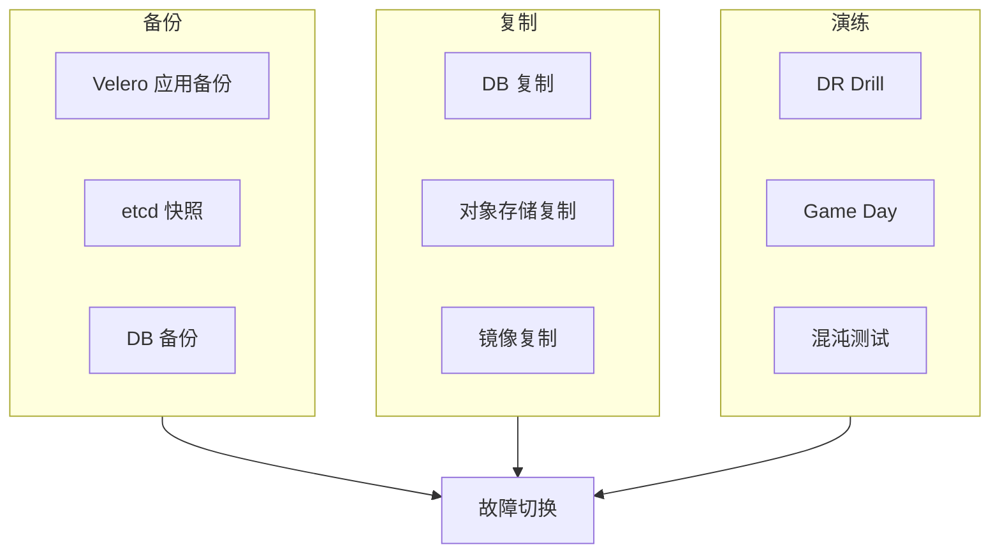
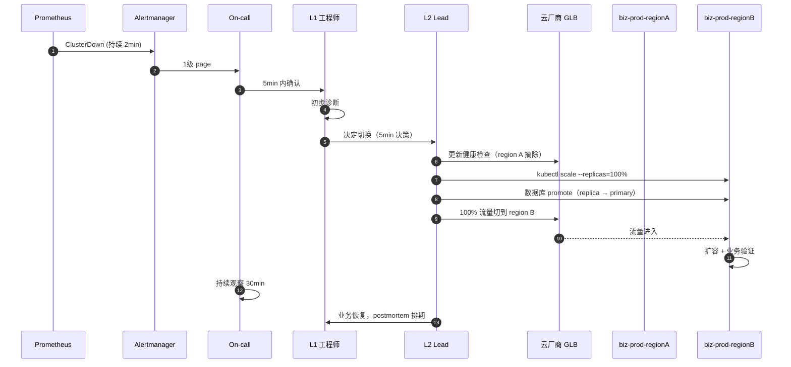

# 容灾方案详细设计

> 范围：OpsHub 平台的灾备体系，包括备份、恢复、跨 region 切换、演练。
> 适用：v1.0（2026-09）
> 前置：[02-架构设计.md](02-架构设计.md) 第 7 节

---

## 1. 灾备总览

### 1.1 业务等级与 RPO/RTO

| 业务等级 | 数量 | RPO | RTO | 灾备模式 | 资源成本 |
|---|---|---|---|---|---|
| **Tier 0**（核心交易）| 1-3 服务 | < 1 min | < 5 min | 双 region active-active + DB sync | 高（×2 资源）|
| **Tier 1**（关键业务）| 5-10 服务 | < 5 min | < 30 min | 双 region active-passive | 中（×1.3 资源）|
| **Tier 2**（一般业务）| 10+ 服务 | < 1h | < 4h | 跨 region backup-restore | 低（×1.05 资源）|
| **Tier 3**（开发测试）| 任意 | < 24h | < 24h | 同 region 备份 | 极低 |

### 1.2 灾备三要素



---

## 2. 备份策略

### 2.1 Velero 应用备份

**配置**：

```yaml
# 备份存储位置（私有 IDC 主 S3）
apiVersion: velero.io/v1
kind: BackupStorageLocation
metadata:
  name: default
  namespace: velero
spec:
  provider: aws
  objectStorage:
    bucket: opshub-velero-backups
    prefix: velero
  config:
    region: cn-north-1
  credential:
    name: velero-credentials
    key: cloud
---
# 备份存储位置（跨 region DR）
apiVersion: velero.io/v1
kind: BackupStorageLocation
metadata:
  name: dr-region
  namespace: velero
spec:
  provider: aws
  objectStorage:
    bucket: opshub-velero-backups-dr
    prefix: velero
  config:
    region: cn-east-1  # DR region
  credential:
    name: velero-credentials
    key: cloud
---
# 备份策略：每 6h 增量
apiVersion: velero.io/v1
kind: Schedule
metadata:
  name: app-backup-6h
  namespace: velero
spec:
  schedule: "0 */6 * * *"
  template:
    includedNamespaces:
    - "app-*"
    - "biz-*"
    excludedResources:
    - events
    - servicemonitors.monitoring.coreos.com
    snapshotVolumes: true
    ttl: "720h"  # 30 天
---
# 每日全量（业务低峰）
apiVersion: velero.io/v1
kind: Schedule
metadata:
  name: app-backup-daily
  namespace: velero
spec:
  schedule: "0 2 * * *"  # 凌晨 2 点
  template:
    includedNamespaces:
    - "app-*"
    - "biz-*"
    snapshotVolumes: true
    ttl: "2160h"  # 90 天
```

**保留策略**：
- 6h 增量 × 30 天
- 每日全量 × 90 天
- 每周全量 × 1 年
- 每月全量 × 3 年（合规要求）

### 2.2 etcd 备份

```bash
#!/bin/bash
# 伪代码：etcd 自动备份脚本
ETCDCTL_API=3 etcdctl snapshot save /backup/etcd-$(date +%Y%m%d-%H%M%S).db \
  --endpoints=https://127.0.0.1:2379 \
  --cacert=/etc/kubernetes/pki/etcd/ca.crt \
  --cert=/etc/kubernetes/pki/etcd/server.crt \
  --key=/etc/kubernetes/pki/etcd/server.key

# 加密
gpg --symmetric --cipher-algo AES256 /backup/etcd-*.db

# 上传到 S3
aws s3 cp /backup/etcd-*.db.gpg s3://opshub-etcd-backups/etcd/ --sse aws:kms

# 清理本地
rm /backup/etcd-*.db /backup/etcd-*.db.gpg

# 保留 30 天
find /backup -name "etcd-*" -mtime +30 -delete
```

**执行频率**：
- 每 6h 增量
- 每日全量
- 保留 30 天

### 2.3 数据库备份

**PostgreSQL（业务核心 DB）**：
```bash
# 全量（每日凌晨）
pg_basebackup -Ft -D /backup/pg-$(date +%Y%m%d) -U replicator -h primary.db

# WAL 归档（持续）
archive_command = 'aws s3 cp %p s3://opshub-db-wal/%f'

# 保留策略
# 日全量 × 7
# 周全量 × 12
# 月全量 × 36
```

**MySQL（业务次要 DB）**：
- Percona XtraBackup 全量
- binlog 实时归档
- 同 PostgreSQL 保留策略

**Redis（缓存）**：
- 缓存数据无需持久备份
- 业务可接受冷启动（5 min）

### 2.4 镜像与制品备份

Harbor 自带复制策略：

```yaml
# Harbor replication rule（私有 IDC → 各 region）
name: opshub-sync-to-cloud
description: 同步 opshub 镜像到公有云 region
trigger: event_based  # push 触发
filters:
  name-pattern: "ops-*"  # 只同步平台镜像
  tag-pattern: "v*"
  resource: image
destinations:
- name: cloud-region-a
  endpoint: https://harbor-region-a.ops.internal
  username: replication-user
  password: <vault-managed>
  override: false
  enabled: true
```

### 2.5 备份存储

- **主备份库**：私有 IDC S3（AES-256 加密 + Object Lock 90 天）
- **DR 备份库**：公有云 region B S3（同样加密 + Object Lock）
- **冷备份库**：公有云归档存储（Glacier / 归档存储）1 年以上

**S3 Object Lock 配置**：
```json
{
  "ObjectLockEnabled": "Enabled",
  "ObjectLockConfiguration": {
    "Rule": {
      "DefaultRetention": {
        "Mode": "GOVERNANCE",
        "Days": 90
      }
    }
  }
}
```

---

## 3. 复制策略

### 3.1 数据库复制

| 数据库 | 模式 | 跨 region 延迟 | 冲突处理 |
|---|---|---|---|
| PostgreSQL（Tier 0）| 同步复制（2PC）| < 50ms | 自动冲突检测 |
| PostgreSQL（Tier 1）| 异步流复制 | 100-500ms | 单主写，从升主需 promote |
| MySQL | 半同步复制 | 100-300ms | 单主写 |
| Redis | 异步复制 | 50-200ms | 数据可重建 |

**同步复制的限制**：
- 跨 region 延迟必须 < 50ms（同 region 不同 AZ 可行）
- 否则降级为异步
- 同步模式下，region 故障导致主不可写 → 切到对端

### 3.2 对象存储复制

**S3 Cross-Region Replication (CRR)**：
- 备份桶：私有 IDC → 公有云 region B（15min SLA via RTC）
- 业务桶：各 region 独立（如有需要可配双向复制）
- 配置版本控制 + MFA delete

### 3.3 镜像复制

见 2.4 节。

### 3.4 配置复制

- ArgoCD Application YAML 通过 Git 复制（自动）
- Sealed Secrets 通过 Git 复制
- Vault 数据通过 Raft 复制（3 节点）

---

## 4. 故障切换流程

### 4.1 业务集群 region 切换



**关键决策点（人工判断）**：
- 是否真切换（不是瞬时抖动）？
- 切换速度：warm-up（10%/30%/100%）vs 直接 100%？
- 是否同时回切 region A？

**自动化决策（脚本辅助）**：
- 检测时长（持续 2min 才触发）
- 健康检查通过率（> 80% 才被认为恢复）
- 数据库复制延迟（< 1s 才允许切主）

### 4.2 数据库故障切换

**主库故障**：
```bash
#!/bin/bash
# 伪代码：DB 切换脚本
# 1. 检测主库健康
if ! pg_isready -h $PRIMARY_HOST; then
  echo "Primary down at $(date)"

  # 2. 选出最新副本
  REPLICA=$(get_latest_replica.sh)

  # 3. 提升为新主
  ssh $REPLICA "pg_ctl promote"

  # 4. 更新应用配置
  kubectl patch configmap db-config -p "{\"data\":{\"primary\":\"$REPLICA\"}}"

  # 5. 通知 on-call
  curl -X POST $ALERT_WEBHOOK -d "DB failed over to $REPLICA"
fi
```

**人为审批（关键操作）**：
- 主库 promote 需要 2 人审批
- 所有切换操作留 audit log
- 切换后 1h 内必须有 postmortem 准备

### 4.3 平台集群故障

`ops-mgmt` 自身故障相对少见但影响面大：

**应急恢复步骤**：
1. **DNS 指向临时 GLB**（5min）：临时访问只读 ArgoCD
2. **从 Git 恢复状态**（15min）：用 `argocd app sync --force` 重建
3. **PG 数据从备份恢复**（30min）：Keycloak/Harbor/ArgoCD
4. **验证关键功能**（1h）：SSO、镜像、GitOps
5. **切换回新集群**（2h）：DNS 切回

**预防措施**：
- 平台集群 HA（多 control-plane + 多 worker）
- 关键数据（Keycloak PG）实时复制到 DR
- 关键配置（ArgoCD）从 Git 恢复

### 4.4 私有 IDC 整体故障

**最坏情况**：私有 IDC 完全不可用。

**应急方案**：
1. 公有云 region 临时拉起"平台 DR 集群"（Cluster API 自动化）
2. 1-2h 内 ArgoCD/Keycloak/Harbor 在公有云可用
3. 业务集群从公有云 region 访问（Submariner tunnel 重建）
4. 数据从跨 region 备份恢复

**所需前提**：
- Cluster API 模板预置（Git 中）
- Terraform 脚本预置
- 数据备份 S3 桶在公有云（独立于私有 IDC）
- 跨 region 网络快速建立（专线备份：4G/5G + 临时 VPN）

---

## 5. RPO/RTO 实施细节

### 5.1 Tier 0（核心交易）< 1 min / < 5 min

| 组件 | RPO 实现 | RTO 实现 |
|---|---|---|
| 应用 | 多活（active-active）| 自动健康检查 + 流量切换 |
| 数据库 | 同步复制 | 故障时切主（30s 内）|
| 镜像 | 实时复制 | 已就绪无需恢复 |
| 配置 | Git | ArgoCD 自动 pull |

**架构示意**：
```
Region A (主)          Region B (备)
┌──────────────┐      ┌──────────────┐
│ App × 3      │      │ App × 3      │
│ DB Primary   │◄────►│ DB Sync      │  ← 同步复制
│ Object Store │      │ Object Store │
└──────┬───────┘      └──────┬───────┘
       └────── GLB ──────────┘
       (健康检查 + 流量分配)
```

### 5.2 Tier 1（关键业务）< 5 min / < 30 min

| 组件 | RPO 实现 | RTO 实现 |
|---|---|---|
| 应用 | warm standby | 30 min 内 scale up + 切换 |
| 数据库 | 异步流复制 | 切主 + 追平日志（5min）|
| 镜像 | push 触发复制 | 已就绪 |
| 配置 | Git | ArgoCD |

### 5.3 Tier 2（一般业务）< 1h / < 4h

| 组件 | RPO 实现 | RTO 实现 |
|---|---|---|
| 应用 | backup-restore | Velero restore（1-2h）|
| 数据库 | 6h 备份 + WAL | 从备份恢复（2-4h）|
| 镜像 | 复制 | 已就绪 |
| 配置 | Git | ArgoCD |

### 5.4 Tier 3（开发测试）< 24h / < 24h

| 组件 | RPO 实现 | RTO 实现 |
|---|---|---|
| 应用 | 每日备份 | Velero restore |
| 数据库 | 每日备份 | 从备份恢复 |
| 其他 | 不需要 | 不需要 |

---

## 6. 演练计划

### 6.1 DR Drill 频率

| 等级 | 频率 | 时长 | 范围 |
|---|---|---|---|
| Tier 0 | 月度 | 2-4h | 单 region 切换全流程 |
| Tier 1 | 季度 | 4-8h | 单 region 切换全流程 |
| Tier 2 | 半年 | 8h | restore 演练 |
| 平台 | 半年 | 8h | ops-mgmt 故障恢复 |

### 6.2 DR Drill 检查清单

**事前（演练前 1 周）**：
- [ ] 通知所有相关方
- [ ] 备份最新状态
- [ ] 准备回滚脚本
- [ ] 安排 on-call 待命

**事中（演练中）**：
- [ ] 记录每一步耗时
- [ ] 观察告警是否正确触发
- [ ] 记录异常情况
- [ ] 测量实际 RTO

**事后（演练后 1 周）**：
- [ ] 编写 postmortem
- [ ] 更新 runbook
- [ ] 改进自动化脚本
- [ ] 跟进改进项

### 6.3 Game Day（年度大型演练）

**年度 game day**：
- 1 次/年，跨部门参与
- 模拟最坏情况（如 region 整体不可用）
- 业务方深度参与
- 全程录屏 + 复盘
- 对外汇报（管理层 + 业务方）

---

## 7. 备份验证自动化

**核心原则**：**未验证的备份等于没有备份**。

### 7.1 自动验证脚本

```bash
#!/bin/bash
# 每周自动验证 Velero 备份可恢复
# 1. 选择最近一次成功备份
BACKUP=$(velero backup get -o json | jq -r '.items | sort_by(.metadata.creationTimestamp) | reverse | .[0].metadata.name')

# 2. 恢复到独立 namespace
TEST_NS="dr-test-$(date +%s)"
velero restore create --from-backup $BACKUP \
  --namespace-mappings app-payment:dr-test-payment \
  --namespace-mappings app-checkout:dr-test-checkout

# 3. 等待 restore 完成
velero restore wait dr-test-restore --timeout 30m

# 4. 验证 pod 启动
sleep 60
kubectl get pods -n dr-test-payment -o json | \
  jq -e '.items[] | select(.status.phase != "Running")' && {
  echo "FAIL: pods not running"
  exit 1
}

# 5. 验证应用健康
curl -f http://dr-test-payment.example.com/healthz || {
  echo "FAIL: app not healthy"
  exit 1
}

# 6. 清理
kubectl delete namespace $TEST_NS
velero restore delete dr-test-restore

# 7. 通知 on-call 验证通过
echo "PASS: backup $BACKUP verified"
```

### 7.2 验证 SLA

- **每周**：自动验证最近备份可恢复
- **每月**：人工验证 + 完整流程演练
- **每季度**：跨 region 验证
- **每年**：完整 Game Day

---

## 8. 恢复 Runbook（示例）

### 8.1 单业务 namespace 误删恢复

```bash
# 1. 列出最近备份
velero backup get | head

# 2. 恢复指定 namespace
velero restore create restore-payment --from-backup daily-20260101-0200 \
  --include-namespaces app-payment

# 3. 观察
velero restore logs restore-payment --follow

# 4. 验证
kubectl get all -n app-payment
curl -f https://payment.example.com/healthz
```

### 8.2 整个 region 重建

```bash
# 1. Cluster API 创建新集群
kubectl apply -f clusters/biz-prod-regiona-new.yaml

# 2. 等待集群就绪（约 15-30 min）
clusterctl describe cluster biz-prod-regiona-new

# 3. 恢复 ArgoCD
argocd cluster add biz-prod-regiona-new
kubectl apply -f argocd-apps/  # 触发 sync

# 4. 恢复业务 namespace
velero restore create full-restore --from-backup latest

# 5. 验证所有服务
./scripts/verify-all-services.sh
```

### 8.3 数据库完全丢失

```bash
# 1. 启动新 DB 实例
terraform apply -target=aws_db_instance.payment_primary

# 2. 从最新备份恢复
pg_basebackup -Ft -D /var/lib/postgresql/restore -U replicator -h new-primary.db

# 3. 应用 WAL 归档
cd /var/lib/postgresql/restore
echo "restore_command = 'aws s3 cp s3://opshub-db-wal/%f %p'" >> postgresql.auto.conf
pg_ctl start

# 4. 验证数据
psql -h new-primary.db -c "SELECT count(*) FROM users"

# 5. 切换应用
kubectl patch configmap db-config -p "{\"data\":{\"primary\":\"new-primary.db\"}}"

# 6. 通知业务方验证
```

---

## 9. 灾备 SLA 监控

**核心指标**：
- 备份成功率（应 > 99.9%）
- 备份完整性（每周自动验证）
- 恢复演练 RTO（应达标）
- 备份存储增长（异常增长要告警）

**Grafana 仪表板**：
- 备份任务执行情况
- 存储使用趋势
- 跨 region 复制延迟
- DR drill 历史结果

**告警**：
- 备份连续 2 次失败 → ticket
- 备份存储 > 80% 容量 → ticket
- 跨 region 复制延迟 > 30min → page
- DR drill 超过 SLA → 季度 review

---

## 10. 灾备预算

| 项目 | 月度成本（USD）|
|---|---|
| S3 备份存储（主）| $500 |
| S3 备份存储（DR）| $1,000 |
| 冷归档存储 | $200 |
| 跨 region 复制流量 | $300 |
| 演练人力成本 | $2,000（季度分摊）|
| **合计** | **$4,000/月** |

vs 不做灾备的风险成本：1 次重大事故平均 $1M+。

---

## 11. 合规与审计

- **等保 2.0 三级**：要求数据备份 + 异地容灾 ✓
- **ISO 22301（业务连续性）**：本方案可直接作为 BC 计划 ✓
- **FISC（日本金融机构安全）**：可参考 ✓

**审计要求**：
- 备份日志保留 1 年
- DR drill 报告归档
- 备份策略变更需审批
- 灾备切换必须事后复盘

---

## 12. 演进路径

| 阶段 | 时间 | 内容 |
|---|---|---|
| **当前（v1.0）** | 2026 Q4 | Velero + S3 + 跨 region 复制 |
| **v1.1** | 2027 H1 | 数据库自动 promote 工具 + DR drill 平台化 |
| **v2.0** | 2027 H2 | 多云灾备（公有云 ↔ 公有云）+ 一键切流 |
| **v3.0** | 2028 | AI 辅助决策（自动判断是否切换）|
