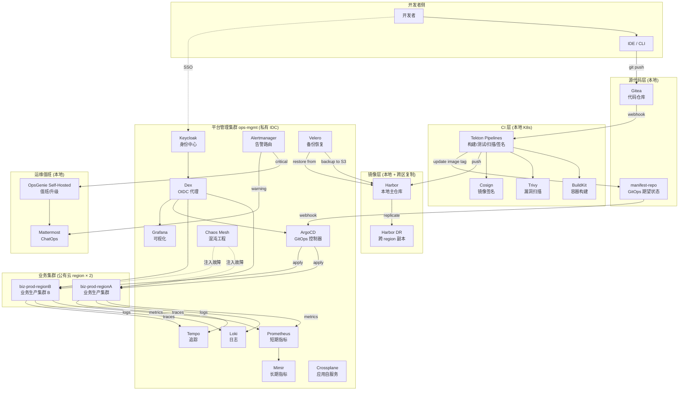
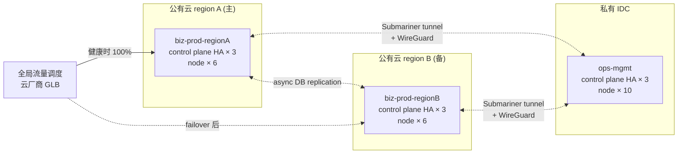
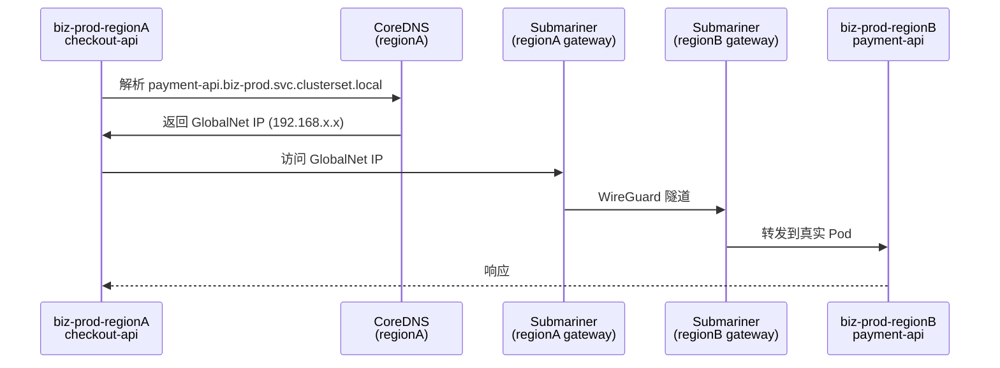
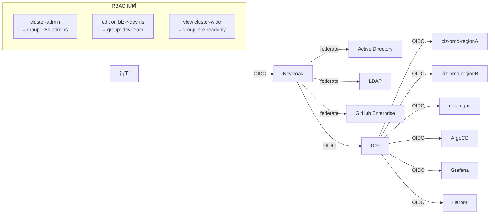
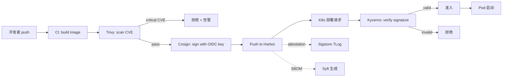
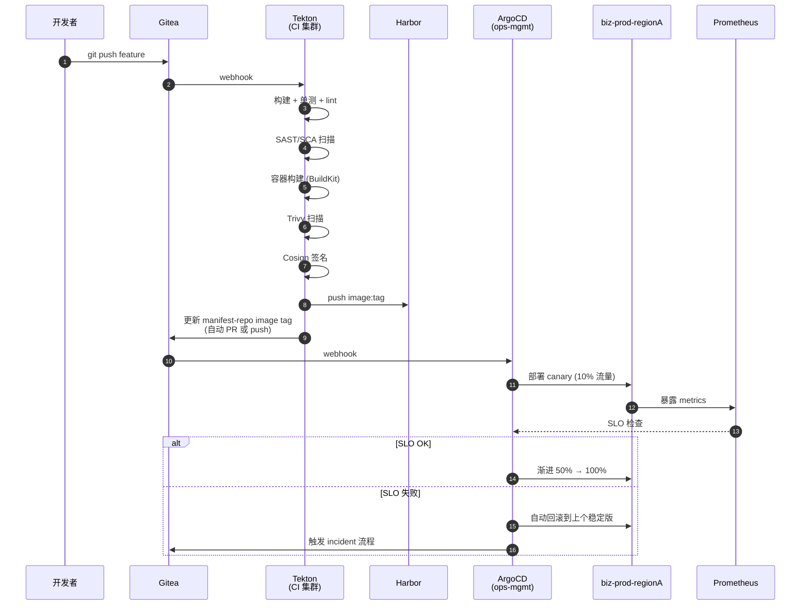
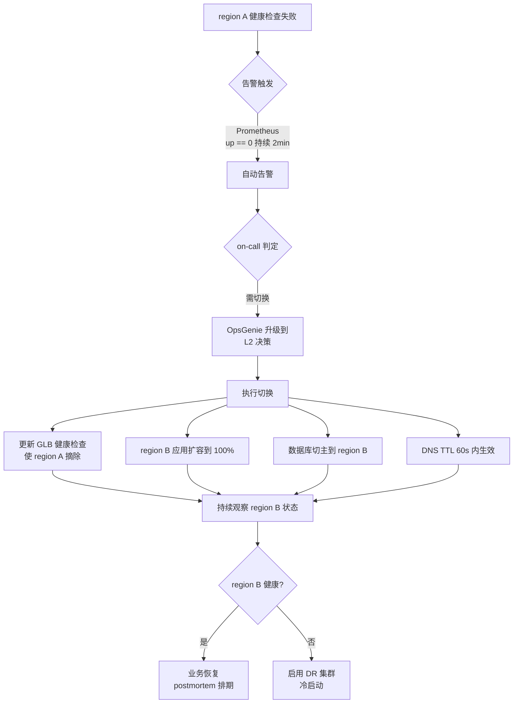

# 架构设计文档（阶段二交付物 · 主文档）

> 适用：`OpsHub` 运维平台 v1.0
> 读者：SRE 平台团队 / 架构评审委员会 / 新入职平台工程师
> 状态：v1.0（2026-09）
> 前置阅读：[01-调研报告](../01-research/01-调研报告.md)

---

## 0. TL;DR

`OpsHub` 是一套面向**金融/制造类企业的 Kubernetes 多集群混合云运维平台**，覆盖从代码提交到生产运维的全链路。设计原则：

1. **Git 是唯一事实源**——所有变更通过 PR 留痕
2. **平台与业务解耦**——平台集群（`ops-mgmt`）独立于业务集群（`biz-*`）
3. **多 region 同云**——双公有云 region + 私有 IDC，三层灾备
4. **零信任 + 全自管**——身份/镜像/可观测全本地化，不依赖 SaaS
5. **SLO 驱动**——所有告警基于 SLO burn rate，不做静态阈值

```
    开发者 → Git (本地 Gitea) → CI (Tekton) → 镜像 (Harbor + Cosign) 
       → GitOps (ArgoCD) → K8s (多集群) 
       → 可观测 (LGTM + Mimir) + 告警 (Alertmanager)
       → 故障响应 (Chaos Mesh + Velero)
```

---

## 1. 整体架构

### 1.1 高层架构图



### 1.2 分层职责

| 层 | 职责 | 关键组件 | 部署位置 |
|---|---|---|---|
| 开发者侧 | 编码、本地测试、提交 | IDE, Git CLI | 开发者本地 |
| 源代码层 | 代码托管、GitOps 期望状态 | Gitea, manifest-repo | 私有 IDC（多副本 HA） |
| CI 层 | 构建、测试、扫描、签名 | Tekton, BuildKit, Trivy, Cosign | 平台 K8s 集群 |
| 镜像层 | 镜像托管、复制、策略 | Harbor, Trivy, Cosign | 主仓库私有 IDC + 副本各 region |
| 控制面 | GitOps 协调、身份、可观测、灾备、混沌 | ArgoCD, Keycloak, Dex, LGTM+ Mimir, Velero, Chaos Mesh, Crossplane | 平台集群 `ops-mgmt`（私有 IDC） |
| 数据面 | 业务应用运行 | 应用工作负载 | 公有云 2 region（业务 + 业务） |
| 运维值班 | 通知、告警、值班升级 | Mattermost, OpsGenie 替代品 | 私有 IDC |

---

## 2. 多集群拓扑

### 2.1 集群分类

OpsHub 有 4 种集群类型：

| 类型 | 命名 | 数量 | 位置 | 用途 |
|---|---|---|---|---|
| 平台管理集群 | `ops-mgmt` | 1 (主) + 1 (热备) | 私有 IDC | ArgoCD / Keycloak / 可观测 / 备份 / 混沌 |
| 业务生产集群 | `biz-prod-{region}` | 2 (regionA + regionB) | 公有云 region A + B | 业务应用主备 |
| 业务预发集群 | `biz-staging` | 1 | 公有云 region A | 预发验证 |
| 业务开发集群 | `biz-dev` | 1 | 私有 IDC | 日常开发、自测 |

**设计原则**：
- **Cattle, not pets**：业务集群可任意销毁重建（通过 Cluster API）
- **集中管控**：所有集群由 `ops-mgmt` 上的 ArgoCD 通过 ApplicationSet 统一管理
- **无 meta-control-plane**：拒绝 KubeFed 风格，避免"集中 etcd"单点

### 2.2 多 region 业务集群拓扑



**业务流量路由**：
- region A 处理主流量（健康时 100%）
- region B 处于"warm standby"（Pod 数量缩减为 30%，数据异步复制）
- 通过云厂商全局负载均衡器（AWS Global Accelerator / Azure Front Door / GCP GLB）做健康检查 + 故障切换

### 2.3 Cluster API 供给

业务集群**全部通过 Cluster API 声明式创建/销毁/升级**：

```yaml
# cluster-api manifests 示例（简化）
apiVersion: cluster.x-k8s.io/v1beta1
kind: Cluster
metadata:
  name: biz-prod-regiona
  namespace: capi-system
spec:
  infrastructureRef:
    apiVersion: infrastructure.cluster.x-k8s.io/v1beta1
    kind: AWSManagedCluster
    name: biz-prod-regiona
  controlPlaneRef:
    kind: KubeadmControlPlane
    name: biz-prod-regiona-control-plane
---
# 同理 ClusterDeployment for region B
```

**好处**：
- 集群定义即代码，GitOps 闭环
- 升级/扩缩容/销毁都是 Git 提交
- 灾难恢复时，新集群 30 分钟可拉起

---

## 3. 网络架构

### 3.1 网络分层

```mermaid
flowchart TB
    subgraph external["外部"]
        User[终端用户]
        Internet[公网]
    end

    subgraph edge["边缘层 (公有云)"]
        GLB[云厂商 GLB\nWAF / DDoS]
    end

    subgraph app["应用层 (业务集群)"]
        Ingress[Ingress Controller\n(Nginx / Envoy)]
        ServiceMesh[Istio / Linkerd\nService Mesh]
        Apps[业务 Pods]
    end

    subgraph data["数据层 (跨集群)"]
        DBPrimary[(DB Primary\nregion A)]
        DBReplica[(DB Replica\nregion B)]
        ObjStore[S3 / OSS\n对象存储]
    end

    subgraph platform["平台层 (私有 IDC)"]
        PIngress[平台 Ingress]
        PMesh[平台 Mesh]
        PApps[平台组件]
    end

    User --> Internet
    Internet --> GLB
    GLB --> Ingress
    Ingress --> ServiceMesh
    ServiceMesh --> Apps
    Apps --> DBPrimary
    Apps --> DBReplica
    Apps --> ObjStore

    Apps -.->|metrics/logs/traces\nOTel gRPC| PApps
    PApps -.->|GitOps pull\ngit protocol| PIngress
```

### 3.2 网络分区

| 网段 | 用途 | 互通规则 |
|---|---|---|
| `10.0.0.0/8` | 私有 IDC 内网 | 内部互通 |
| `10.100.0.0/16` | ops-mgmt 集群 Pod CIDR | 集群内互通 |
| `10.101.0.0/16` | biz-prod-regionA Pod CIDR | 集群内互通 |
| `10.102.0.0/16` | biz-prod-regionB Pod CIDR | 集群内互通 |
| `172.16.0.0/12` | 公有云 VPC 内部 | 集群内互通 |
| `192.168.0.0/16` | Submariner GlobalNet | 跨集群 Pod 寻址 |
| Submariner tunnel | 跨集群加密隧道 (WireGuard) | 通过公网/IPSec |

**硬规则**：
- ❌ 任何业务 Pod 不允许直接访问公网（出向走 NAT 网关）
- ❌ 平台集群 Pod 不允许访问业务数据库（数据面与控制面分离）
- ✅ 跨集群流量必须经 Submariner 隧道
- ✅ 所有南北向流量经 GLB + WAF

### 3.3 跨集群服务发现



**关键设计**：
- 用 Kubernetes MCS API（`multicluster.x-k8s.io`）的 `ServiceExport` / `ServiceImport`
- 远程服务以 `<svc>.<ns>.svc.clusterset.local` 域名暴露
- Submariner GlobalNet 处理 CIDR 冲突

### 3.4 安全隔离

| 隔离级别 | 措施 |
|---|---|
| 命名空间 | NetworkPolicy 默认 deny，按 namespace 打白名单 |
| 集群间 | Cilium / Calico NetworkPolicy 跨集群策略 |
| 出口 | Egress Gateway + IP 白名单（业务访问外部 API 走审批） |
| 入口 | WAF + 速率限制 + Bot 检测 |
| 加密 | mTLS（Istio）+ WireGuard（跨集群） + TLS 1.3（南北向） |

---

## 4. 安全模型

### 4.1 身份与访问控制



**用户身份流**：
1. 员工用公司 AD 账号登录 Keycloak
2. Keycloak 颁发 OIDC token（含 groups claim）
3. Dex 联邦 AD + GitHub 等 IdP，统一对外暴露 OIDC
4. 所有平台组件（ArgoCD / Grafana / K8s）信任 Dex
5. K8s RBAC 把 groups 映射到 ClusterRole

**组 → 角色映射**：
| Keycloak Group | 权限 | 范围 |
|---|---|---|
| `k8s-platform-admins` | cluster-admin | 所有集群 |
| `k8s-sre` | view + 部分 edit (incident 期间) | 所有集群 |
| `dev-team-payment` | admin on `payment-*` ns | 业务集群 |
| `dev-team-checkout` | admin on `checkout-*` ns | 业务集群 |
| `k8s-developers-prod` | edit on `app-*` ns (非 prod 资源) | 业务集群 |
| `k8s-readonly` | view | 所有集群 |

### 4.2 镜像供应链安全



**强制策略（Kyverno）**：
- 业务集群所有 Pod 必须有 Cosign 签名（除 `kube-system` 等系统命名空间）
- 拒绝来自 `latest` tag 的镜像
- 拒绝未在白名单 registry 的镜像
- 拒绝以 root 用户运行的容器
- 拒绝 `privileged: true`
- 强制 `readOnlyRootFilesystem: true`

### 4.3 密钥与凭证

| 密钥类型 | 存储方案 | 轮转策略 |
|---|---|---|
| K8s Secrets (应用配置) | Sealed Secrets + Git | 90 天 |
| 云厂商 AccessKey | Vault + IAM 角色（IRSA / Workload Identity） | 短期 STS token |
| 数据库密码 | Vault Dynamic Secrets | 24h 自动轮转 |
| TLS 证书 | cert-manager + Let's Encrypt / 企业 CA | 90 天自动续签 |
| OIDC client secret | Vault | 180 天 |
| SSH 密钥 | Teleport / Boundary | 短时凭证 |

### 4.4 审计与合规

| 类别 | 工具 | 保留 |
|---|---|---|
| K8s API 审计日志 | K8s audit log + Loki | 6 个月（合规要求） |
| 镜像签名/扫描 | Harbor audit log + Sigstore TLog | 永久 |
| 用户登录 | Keycloak event log | 6 个月 |
| Git 操作 | Gitea audit log | 6 个月 |
| 网络流量 | VPC 流日志 + Cilium Hubble | 90 天 |
| 数据库访问 | DB audit log | 6 个月 |
| 告警与事件 | Alertmanager + Mattermost | 1 年 |

---

## 5. 发布流程

### 5.1 端到端发布流水线



### 5.2 发布策略

按业务等级分层：

| 业务等级 | 发布策略 | 验证 | 流量切换 |
|---|---|---|---|
| Tier 0（核心） | Blue/Green + 人工审批 | 完整 e2e + 性能测试 | 0% → 10% → 50% → 100% |
| Tier 1（重要） | Canary + Argo Rollouts | e2e + 关键路径 | 0% → 25% → 100% |
| Tier 2（一般） | 滚动更新 | 单元测试 | 直接 100% |
| Tier 3（开发） | 直接 apply | 无 | 100% |

### 5.3 环境晋升链

```
代码 → dev (自动) → staging (自动 + 集成测试) → canary (自动 + SLO 观察 30min) → prod (Tier 0/1 人工审批, Tier 2 自动)
```

每个环境对应一个 manifest-repo overlay：
- `overlays/dev/` — 最低资源，自动 deploy
- `overlays/staging/` — 中等资源，自动 deploy
- `overlays/canary/` — 生产规模 10%，SLO 观察
- `overlays/prod/` — 全量

### 5.4 GitOps 应用模型

**App of Apps 模式**：

```
ops-mgmt
  └─ argocd
       └─ root-app (ApplicationSet)
            ├─ platform-apps (ApplicationSet)
            │    ├─ keycloak
            │    ├─ dex
            │    ├─ grafana
            │    ├─ prometheus
            │    ├─ loki
            │    ├─ tempo
            │    ├─ alertmanager
            │    ├─ velero
            │    ├─ chaos-mesh
            │    └─ crossplane
            │
            └─ biz-clusters (ApplicationSet with cluster generator)
                 ├─ biz-prod-regionA  → 若干应用 Application
                 ├─ biz-prod-regionB  → 若干应用 Application
                 ├─ biz-staging       → 若干应用 Application
                 └─ biz-dev           → 若干应用 Application
```

每个 Application 都有 `automated.selfHeal: true`，发生 drift 时自动回滚到 Git 状态。

---

## 6. 可观测方案

### 6.1 三大支柱采集

```mermaid
flowchart TB
    subgraph apps["业务应用"]
        SDK[OpenTelemetry SDK\n(injected sidecar or lib)]
    end

    subgraph collect["采集层"]
        OTelCol[OTel Collector\nDaemonSet]
        Prom[Prometheus\nscrape]
        Promtail[Promtail\nDaemonSet]
    end

    subgraph store["存储层"]
        PromS[Prometheus\n短期 15d]
        MimirS[Mimir\n长期]
        LokiS[Loki\n+S3 backend]
        TempoS[Tempo\n+S3 backend]
    end

    subgraph visual["可视化"]
        Grafana[Grafana]
    end

    SDK -->|OTLP gRPC| OTelCol
    OTelCol -->|metrics| PromS
    OTelCol -->|traces| TempoS
    Prom --> PromS
    Promtail --> LokiS
    PromS --> MimirS
    MimirS --> Grafana
    LokiS --> Grafana
    TempoS --> Grafana
```

**关键设计**：
- 所有应用 **必须** 用 OTel SDK 注入（Go/Java/Python/Node/JS 都有官方 SDK）
- OTel Collector 用 DaemonSet（每节点一个），不直接外发
- Prometheus 短期（15 天）+ Mimir 长期（> 1 年）
- Loki 索引 labels，存原始日志到 S3
- Tempo 存 trace spans 到 S3
- Grafana 统一可视化，三大信号关联（点击 metric 跳到 log 和 trace）

### 6.2 关键 SLO 指标

服务上线**必须**先定义 SLO（OpsHub 提供 SLO YAML 模板）：

| 服务等级 | 例子 | SLO |
|---|---|---|
| Tier 0 | checkout-api | 99.95% < 800ms (30d) |
| Tier 0 | payment-api | 99.99% < 1.5s (30d) |
| Tier 1 | user-service | 99.9% < 500ms (30d) |
| Tier 2 | report-api | 99% < 5s (30d) |
| 平台 | ArgoCD | 99.9% API 可用 (30d) |
| 平台 | Harbor | 99.5% 推送可用 (30d) |

### 6.3 告警策略

**SLO Burn Rate 多窗口告警**（Google SRE Workbook 标准）：

```yaml
# 范例：checkout-api 的 burn rate 告警
groups:
- name: checkout-api-slo
  rules:
  - alert: CheckoutAPIBurnRateFast
    expr: |
      (sum(rate(http_requests_total{service="checkout-api",code=~"5.."}[5m]))
       / sum(rate(http_requests_total{service="checkout-api"}[5m])))
      > (14.4 * 0.0005)
    for: 2m
    labels:
      severity: critical
      slo: checkout-api-availability
    annotations:
      summary: "checkout-api 1h 内耗光月度 error budget"
      runbook: "https://wiki.internal/runbooks/checkout-api-burn"
```

| Burn Rate | 窗口 | 行为 |
|---|---|---|
| 14.4x | 5 min | **Page** （1h 耗光预算） |
| 6x | 30 min | **Page** |
| 3x | 1h | **Ticket** |
| 1x | 6h | **Email** |
| 静态异常 | 任意 | **Dashboard** |

**Alertmanager 路由**：
- `severity: critical` → OpsGenie → 值班 on-call
- `severity: warning` → Mattermost `#alerts-warning`
- `severity: info` → dashboard only
- 抑制规则：critical 触发时同 service 的 warning 抑制

### 6.4 值班与升级

```
告警触发 → Alertmanager
  ↓
OpsGenie Self-Hosted（值班排班）
  ├─ 1级（L1, 5 min 未响应）
  │   ↓
  │   升级到 2级（L2, 工程师 lead）
  │   ↓
  │   升级到 3级（L3, 架构师 / SRE 负责人）
  │
  └─ incident channel 自动创建 in Mattermost
       └─ 自动拉 on-call、相关业务方、记录 timeline
```

值班规则：
- 7×24 双人值班（primary + secondary）
- 一班最多 2 个 page（健康指标）
- 新人 4 周 shadow 后才能独立 on-call
- 强制 blameless postmortem 每次 P0/P1

---

## 7. 灾备方案

### 7.1 RPO/RTO 分级

| 业务等级 | 数量 | RPO | RTO | 灾备模式 |
|---|---|---|---|---|
| Tier 0（核心交易） | 1-3 服务 | < 1 min | < 5 min | 双 region active-active + DB 同步 |
| Tier 1（关键业务） | 5-10 服务 | < 5 min | < 30 min | 双 region active-passive + 持续复制 |
| Tier 2（一般业务） | 10+ 服务 | < 1h | < 4h | 跨 region backup-restore |
| Tier 3（开发测试） | 任意 | < 24h | < 24h | 同 region 备份 |

### 7.2 备份策略

**Velero 备份**（应用层）：
- 每 6h 增量 + 每日全量
- 保留 7 日每日 + 4 周每周 + 12 月每月
- 跨 region 复制到 S3 (object lock WORM 模式防勒索)
- 每月 1 号做完整 DR drill（自动）

**etcd 备份**（控制面）：
- 每 6h snapshot
- 上传到 S3 with KMS encryption
- 保留 30 天

**数据库备份**：
- 主库：每 15 min 增量 binlog + 每日全量
- 副本：异步复制（region A → region B）
- 关键操作（DDL）走审批+审计

**镜像与制品**：
- Harbor 跨 region 复制策略（push 触发）
- 关键 tag 永久保留

### 7.3 故障切换流程



**关键 SLA**：
- 决策时间（on-call 接到告警 → 决定切不切）：≤ 5 min
- 切换执行时间：≤ 10 min
- 总 RTO：≤ 15 min

### 7.4 平台集群灾备

`ops-mgmt` 自身也需要灾备：
- ArgoCD 状态（应用列表）从 Git 恢复
- Keycloak 用户库 PG 实时复制到 DR 节点
- 可观测数据用 S3 永久存储
- 平台集群故障时，新集群 1 小时内拉起（Cluster API + Git 状态恢复）

---

## 8. 容量与成本估算

### 8.1 集群规模假设

| 集群 | 节点数 | 实例类型 | 月成本估算 (USD) |
|---|---|---|---|
| `ops-mgmt` | 10 × 8C32G | 本地物理机 | $0（自建） |
| `biz-prod-regionA` | 30 × 8C32G | 云厂商 8x large | $12,000 |
| `biz-prod-regionB` (热备 30%) | 10 × 8C32G | 同上 | $4,000 |
| `biz-staging` | 6 × 4C16G | 同上 | $1,200 |
| `biz-dev` | 5 × 4C16G | 本地 | $0 |
| **小计** | | | **$17,200/月** |

> 注：云厂商价格随厂商和预留实例策略变化 ±50%。

### 8.2 关键 SaaS 替代品成本节约

由于"安全为硬性底线"不采用 SaaS：
- 监控（vs Datadog $30k/月）: 节省 $30k/月
- 告警（vs PagerDuty Enterprise $5k/月）: 节省 $5k/月
- 日志（vs Splunk $20k/月）: 节省 $20k/月
- **合计节省**：约 $55k/月

### 8.3 隐性成本

- 工程师维护成本：5-15 人平台团队（$50-150k 人/年）
- 培训成本：内部培训 + 外部培训（每年 $20k）
- 灾备演练成本：每季度 1 次，每次 4 小时停服演练成本
- 合规审计成本：每年 $30-50k

### 8.4 优化策略

1. **预留实例**（公有云）：1 年或 3 年预留可省 30-60%
2. **Spot 实例**：用于预发/开发/可中断工作负载，省 60-80%
3. **集群自动扩缩容**：Karpenter（云厂商） + Cluster Autoscaler
4. **镜像清理**：Harbor 自动 GC 不活跃 tag（保留最近 30 个）
5. **日志采样**：Loki 关键服务 100% / 其他 10%
6. **Trace 采样**：Tail-based sampling，错误 100% / 正常 1%

---

## 9. 实施路线图

### Phase 1：本地 PoC（0-1 个月）— 本次交付目标

- [x] 调研报告（阶段一）
- [x] 架构设计（阶段二）
- [ ] kind 多集群编排脚本（mgmt + 2 biz）
- [ ] ArgoCD + ApplicationSet 部署骨架
- [ ] 关键平台组件部署脚本：Keycloak / Dex / Grafana / Prometheus / Loki / Alertmanager
- [ ] 一个示范业务应用（checkout-api）走通完整 CI → 签名 → GitOps 部署 → 可观测链路
- [ ] 故障响应演示脚本：Pod 故障、节点故障、跨 region failover 演练

### Phase 2：试点生产（1-3 个月）

- [ ] 公有云账号申请 + 网络规划
- [ ] ops-mgmt 集群在私有 IDC 部署
- [ ] 1 个业务集群（region A）试运行
- [ ] 接入 1-2 个真实业务（low risk）
- [ ] 完善监控告警、On-call 流程

### Phase 3：双 region（3-6 个月）

- [ ] 业务集群 region B 部署
- [ ] Submariner 跨集群隧道
- [ ] Velero 跨 region 备份
- [ ] DR drill 至少 1 次
- [ ] 接入 Tier 0/1 业务

### Phase 4：规模化（6-12 个月）

- [ ] 全面接入业务
- [ ] 混沌工程自动化
- [ ] 跨云试点（如有需要）
- [ ] 成本优化（预留实例、Spot）
- [ ] 内部开发者门户（Backstage）建设

---

## 10. 验收标准

本次交付（阶段二文档 + 阶段三代码）的成功标准：

- [ ] 文档可讲解：5 分钟向架构师讲清整体架构
- [ ] 代码可运行：一条命令拉起完整 kind 多集群
- [ ] 流程可演练：注入故障 5 分钟内告警并自动恢复
- [ ] 选型可解释：每个工具的"为什么"都有依据
- [ ] 演进可推进：阶段三到阶段四有清晰路径

---

## 11. 关联文档

- 调研报告：[01-调研报告.md](../01-research/01-调研报告.md)
- 关键决策记录：[02-ADR.md](02-ADR.md)
- 安全模型详细：[02-安全模型.md](02-安全模型.md)
- 容灾方案详细：[02-容灾方案.md](02-容灾方案.md)
- 实施代码：[../03-implementation/](../03-implementation/)
