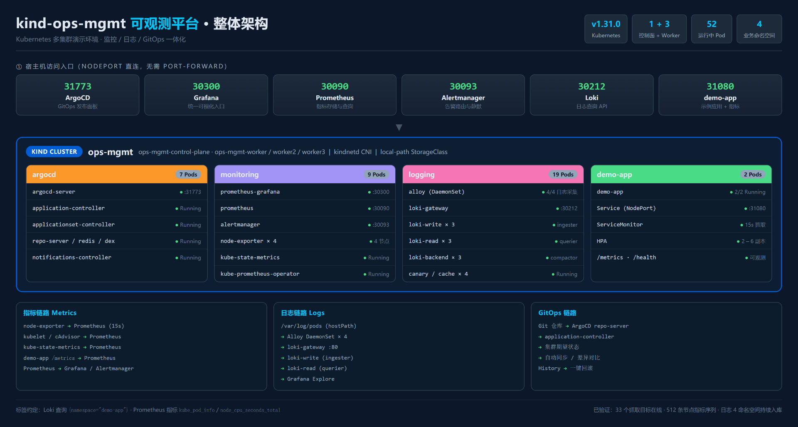
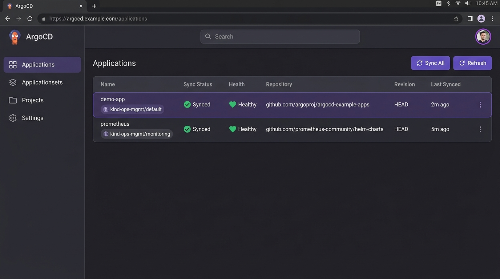
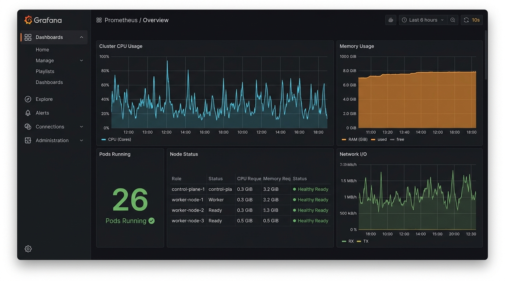

# Kind 多集群环境 — 使用手册

> 本手册面向 DevOps 演示场景，涵盖日常操作、CI/CD 发布、可观测使用和故障处理。

---

## 〇、环境总览



### 〇.1 一句话说明

`ops-mgmt` 集群把 **监控（Prometheus + Grafana + Alertmanager）**、**日志（Loki + Alloy）**、**GitOps（ArgoCD）** 和 **示例应用（demo-app）** 装在同一个 kind 集群里，全部通过 NodePort 暴露到宿主机，浏览器直接开 `localhost:端口` 就能用，不需要 port-forward。

### 〇.2 服务入口速查

| 服务 | 宿主机地址 | 集群内地址 |
|------|-----------|-----------|
| ArgoCD | http://localhost:31773 | argocd-nodeport:80 |
| Grafana | http://localhost:30300 | prometheus-grafana:80 |
| Prometheus | http://localhost:30090 | prometheus-kube-prometheus-prometheus:9090 |
| Alertmanager | http://localhost:30093 | prometheus-kube-prometheus-alertmanager:9093 |
| Loki | http://localhost:30212 | **loki-gateway:80**（不是 8080） |
| demo-app | http://localhost:31080 | demo-app:8080 |

> ⚠️ Loki 集群内端口是 **80**。`loki-gateway` 这个 Service 对外暴露 80，8080 只是 Pod 容器端口。用 8080 会连接超时。

### 〇.3 四个业务命名空间

| 命名空间 | 内容 | Pod 数 |
|---------|------|-------|
| `argocd` | ArgoCD 全套（server / controller / repo-server / redis / dex） | 7 |
| `monitoring` | Prometheus、Grafana、Alertmanager、node-exporter×4、kube-state-metrics | 9 |
| `logging` | Loki 全套（gateway / write×3 / read×3 / backend×3 / canary / cache）+ Alloy×4 | 19 |
| `demo-app` | 示例应用 2 副本 + ServiceMonitor + HPA | 2 |

### 〇.4 三条数据链路

**指标**：`node-exporter` / `kubelet` / `kube-state-metrics` / `demo-app /metrics` → Prometheus（15s 抓取）→ Grafana + Alertmanager

**日志**：节点 `/var/log/pods`（hostPath 挂载）→ Alloy DaemonSet×4 → `loki-gateway:80` → `loki-write`（ingester）→ `loki-read`（querier）→ Grafana Explore

**GitOps**：Git 仓库 → ArgoCD repo-server → application-controller → 自动同步到集群 → History 回滚

---

## 一、环境启动

### 1.1 首次启动

1. 双击 `C:\Users\kim\kind-env\kind-env-start.bat`（管理员权限）
2. 等待 2~3 分钟，看到 `kind clusters ready` 后即可
3. 所有组件自动按顺序启动

### 1.2 日常启动

如果 Docker Desktop 已关闭，重新运行 `kind-env-start.bat` 即可。

### 1.3 验证集群状态

```bash
wsl -d Ubuntu kubectl --context kind-ops-mgmt get nodes
wsl -d Ubuntu kubectl --context kind-ops-mgmt get pods -n monitoring
wsl -d Ubuntu kubectl --context kind-ops-mgmt get pods -n argocd
```

---

## 二、服务访问指南

### 2.1 ArgoCD（GitOps 面板）

**访问地址**：`http://localhost:31773`

**登录凭证**：
- 用户名：`admin`
- 密码：`wG0YYYIbLXX31dVf`

**操作步骤**：

1. 浏览器打开 http://localhost:31773
2. 点击 **Sign in**
3. Username 输入 `admin`
4. Password 输入上面的密码
5. 点击 **Sign in**



**查看已同步的应用**：
- 左侧菜单 → **Applications**
- 可以看到所有 GitOps 管理的应用及其状态（Synced / OutOfSync）

**手动同步应用**：
- 点击应用名称 → **Sync** → **Synchronize**
- 查看差异：点击 **Diff** 标签页

**回滚**：
- 点击应用 → **History** → 选择历史版本 → **Rollback**

---

### 2.2 Grafana（监控面板）

**访问地址**：`http://localhost:30300`

**登录凭证**：
- 用户名：`admin`
- 密码：`sQrlls83VtTlkHU0bL2vVstGbaJ4oeToSNkwYM2b`

> ⚠️ Grafana 密码是 Helm 安装时**随机生成**并存进 Secret 的，不是 `admin123`。
> 随时可以这样查：
> ```powershell
> $env:KUBECONFIG='C:\Users\kim\.kube\config-ops-mgmt'
> $b64 = kubectl -n monitoring get secret prometheus-grafana -o jsonpath='{.data.admin-password}'
> node -e "console.log(Buffer.from('$b64','base64').toString())"
> ```
> 想改成固定密码：删除 Secret 后让 Pod 重启即可
> ```powershell
> kubectl -n monitoring delete secret prometheus-grafana
> kubectl -n monitoring rollout restart deploy/prometheus-grafana
> ```



**查看 K8s 集群仪表盘**：
1. 左侧菜单 → **Dashboards** → **Browse**
2. 搜索 `Kubernetes`
3. 打开 `Kubernetes / Compute Resources / Namespace (Pods)`
4. 选择 namespace `demo-app` 查看应用资源

**查看 Prometheus 指标**：
1. 左侧菜单 → **Explore**
2. 数据源选择 **Prometheus**
3. 输入查询，例如：`up{job="demo-app"}`
4. 点击 **Run query**

**查看 Loki 日志**：
1. 左侧菜单 → **Explore**
2. 数据源选择 **Loki**
3. 输入查询：`{namespace="demo-app"}`
4. 点击 **Run query**

**Loki 常用 LogQL**：
```
# 按命名空间查
{namespace="demo-app"}

# 按 Pod 查
{namespace="demo-app", pod="demo-app-bcf48dd5b-8hspn"}

# 关键字过滤（行过滤）
{namespace="demo-app"} |= "GET /health"

# 排除噪声
{namespace="argocd"} != "healthcheck"

# 错误级别
{namespace=~"demo-app|argocd"} | detected_level="error"

# 最近 5 分钟速率
sum(rate({namespace="demo-app"}[5m]))
```

**Loki 数据源配置**（Grafana → ⚙️ → Data Sources → Loki）：

| 项 | 值 |
|----|-----|
| URL | `http://loki-gateway.logging.svc.cluster.local:80/` |
| Access | `proxy` |
| Custom HTTP Header | `X-Scope-OrgID` = `foo` |

> ⚠️ URL 端口必须是 **80**。`loki-gateway` Service 暴露的是 80，8080 只是 Pod 容器端口，写 8080 会一直超时。

> ℹ️ **Alertmanager / Overview 面板在 Grafana 13 下不可用**：Grafana 13.2.2 的开源镜像没有内置 `alertmanager` 数据源插件，而它被标记为核心插件不允许用 `grafana cli plugins install` 单独安装。告警请直接访问 http://localhost:30093 查看。

---

### 2.5 demo-app（示例应用）

**访问地址**：`http://localhost:31080`

**接口**：

| 路径 | 用途 |
|------|------|
| `/health` | 存活探针 |
| `/ready` | 就绪探针 |
| `/metrics` | Prometheus 抓取（app_info / app_uptime_seconds / app_requests_total） |
| `/` | 版本与副本信息 |

**本地重建镜像**（改了 `demo-app/` 里的代码后）：

```powershell
cd C:\Users\kim\kind-env\demo-app
docker build -t demo-app:v1.0.0 .
kind load docker-image demo-app:v1.0.0 --name ops-mgmt
kubectl apply -f k8s\kind-local.yaml
kubectl -n demo-app rollout status deployment/demo-app --timeout=90s
```

> 注意：清单里必须用 `imagePullPolicy: IfNotPresent`。`Always` 会让 kubelet 去远端拉镜像，而本地镜像没有仓库地址，会直接 ImagePullBackOff。

---

### 2.3 Prometheus（指标查询）

**访问地址**：`http://localhost:30090`（NodePort 直连，无需 port-forward）

**查看告警规则**：
1. 顶部菜单 → **Alerts**
2. 可以看到所有 PrometheusRule 定义的告警及其状态

**查看抓取目标**（排障必备）：
1. 顶部菜单 → **Status → Targets**
2. 应该看到 33 个目标，其中 `kubelet`(12)、`node-exporter`(4)、`kube-state-metrics`(1) 全是 `up`
3. `kube-proxy`、`kube-scheduler`、`kube-controller-manager`、`kube-etcd` 显示 down **是 kind 的正常现象** —— kind 默认不开这些控制面组件的 metrics 端口

**常用查询示例**：
```
# Pod 是否在线
up{job="demo-app"}

# CPU 使用率
rate(container_cpu_usage_seconds_total{namespace="demo-app"}[5m])

# 内存使用
container_memory_working_set_bytes{namespace="demo-app"}

# Pod 重启次数
kube_pod_restart_total{namespace="demo-app"}

# 集群 Pod 总数
count(kube_pod_info)
```

---

### 2.4 Alertmanager（告警管理）

**访问地址**：`http://localhost:30093`（NodePort 直连）

在这里查看当前告警状态、已触发的告警，以及做静默（Silence）和静默到期设置。

---

### 2.6 Loki 日志查询（直接调 API）

不经过 Grafana 也能查：

```powershell
# 注意：Loki 的 start/end 单位是「秒」不是「毫秒」，传错会一直返回空
$end   = [DateTimeOffset]::UtcNow.ToUnixTimeSeconds()
$start = $end - 900
$q = [uri]::EscapeDataString('{namespace="demo-app"}')
Invoke-RestMethod "http://localhost:30212/loki/api/v1/query_range?query=$q&start=$start&end=$end&limit=5" `
  -Headers @{ 'X-Scope-OrgID' = 'foo' }
```

看有哪些标签可选：

```powershell
Invoke-RestMethod "http://localhost:30212/loki/api/v1/labels" -Headers @{ 'X-Scope-OrgID' = 'foo' }
Invoke-RestMethod "http://localhost:30212/loki/api/v1/label/namespace/values" -Headers @{ 'X-Scope-OrgID' = 'foo' }
```

---

### 2.7 Grafana Alloy（日志采集器）

日志采集用 **Grafana Alloy**（Promtail 已于 2025-03 进入 EOL，Alloy 是官方当前标准），以 DaemonSet 形式跑在每个节点上。

**查看状态**：
```powershell
$env:KUBECONFIG='C:\Users\kim\.kube\config-ops-mgmt'
kubectl -n logging get pods -l app.kubernetes.io/name=alloy     # 应该 4/4 Running
kubectl -n logging logs -l app.kubernetes.io/name=alloy --tail=20
```

**关键实现要点**（三个坑，改配置时注意）：
1. **必须挂载宿主机 `/var/log/pods`**（hostPath）。不挂载的话 Alloy 能发现 Pod 元数据但读不到任何文件，表现为「一条日志都收不到」。
2. **RBAC 必须包含 `pods/log` 子资源**。只给 `pods` 的话会一直报 `cannot get resource "pods/log"`。
3. **不要加基于 `__meta_kubernetes_pod_container_init` 的 drop 规则**。Alloy v1.20 上这条规则会让 `loki.source.kubernetes` 拿不到任何 target，而且是**静默失败**（配置加载成功、日志无报错、但零采集）。

配置文件：`logging/alloy/alloy.yaml`

---

## 三、CI/CD 发布流程（端到端演示）

### 3.1 准备示例应用代码

代码已在 `C:\Users\kim\kind-env\demo-app\`，包含：
- `app.py` — Python 健康检查服务
- `Dockerfile` — 容器构建
- `k8s/deployment.yaml` — K8s 部署配置
- `k8s/hpa.yaml` — 自动扩缩容
- `k8s/prometheus-rules.yaml` — Prometheus 告警规则
- `.gitlab-ci.yml` — GitLab CI 流水线

### 3.2 创建 GitLab 项目

1. 打开 https://gitlab.com → 登录 → 点击 **New repository**
2. Repository name 输入 `demo-app`
3. 选择 **Private**
4. 点击 **Create repository**

### 3.3 推送代码到 GitLab

```bash
# 在 demo-app 目录下执行
cd C:\Users\kim\kind-env\demo-app

git init
git add .
git commit -m "Initial commit"
git remote add origin https://gitlab.com/你的用户名/demo-app.git
git push -u origin main
```

### 3.4 配置 GitLab CI/CD Variables

1. GitLab 项目 → **Settings** → **CI/CD** → **Variables** → **Add variable**
2. 添加以下变量：

| Variable | Value | 说明 |
|----------|-------|------|
| `KUBECONFIG_DATA` | base64 编码的 kubeconfig | kubectl 访问集群的凭证 |
| `CI_REGISTRY_USER` | 你的 GitLab 用户名 | 镜像仓库登录 |
| `CI_REGISTRY_PASSWORD` | 你的 GitLab 访问令牌 | 镜像仓库密码 |

**生成 KUBECONFIG_DATA**：
```bash
wsl -d Ubuntu kubectl --context kind-ops-mgmt config view --raw | base64 -w 0
```
复制输出，粘贴为 `KUBECONFIG_DATA` 变量的值。

**生成 GitLab 访问令牌**：
1. GitLab → 右上角头像 → **Preferences** → **Access Tokens**
2. 名称输入 `ci-token`，勾选 `read_registry` `write_repository`
3. 点击 **Create personal access token**
4. 复制 Token，填入 `CI_REGISTRY_PASSWORD`

### 3.5 注册 GitLab Runner

1. GitLab 项目 → **Settings** → **CI/CD** → **Runners**
2. 展开 **Specific runners**，复制 **Registration token**
3. 执行注册命令：

```bash
helm upgrade --install gitlab-runner gitlab/gitlab-runner \
  --namespace gitlab-runner \
  --set gitlabUrl=https://gitlab.com \
  --set runnerRegistrationToken="你的TOKEN" \
  --set runners.lockBuiltIn=false \
  --set runners.privileged=true \
  --set runners.tags="kubernetes,kind" \
  --set rbac.create=true \
  --set rbac.clusterWideAccess=true \
  --wait --timeout 10m
```

4. GitLab Runner 页面刷新，确认 Runner 已显示

### 3.6 触发 CI Pipeline

1. GitLab 项目 → **CI/CD** → **Pipelines** → **Run pipeline**
2. 选择分支 `main`，点击 **Run pipeline**
3. 观察流水线执行：
   - `build` — 构建 Docker 镜像
   - `test-unit` — 单元测试
   - `security-scan` — Trivy 安全扫描
   - `deploy-production` — 部署到 K8s（manual，需要手动触发）

### 3.7 手动触发生产部署

Pipeline 到达 `deploy-production` 阶段时：
1. 点击 `deploy-production` job 右侧的 **▶ Play**
2. 点击 **Play again** 确认
3. 等待部署完成

### 3.8 验证部署

```bash
# 查看 Pod 状态
wsl -d Ubuntu kubectl --context kind-ops-mgmt get pods -n demo-app

# 查看 Service
wsl -d Ubuntu kubectl --context kind-ops-mgmt get svc -n demo-app

# 验证 HPA
wsl -d Ubuntu kubectl --context kind-ops-mgmt get hpa -n demo-app
```

---

## 四、GitOps 演示（ArgoCD 自动同步）

### 4.1 创建 ArgoCD Application

```bash
wsl -d Ubuntu kubectl --context kind-ops-mgmt apply -n argocd -f C:\Users\kim\kind-env\demo-app\argocd\app.yaml
```

> 注意：先将 `app.yaml` 中的 `https://gitlab.com/YOUR_USERNAME/demo-app.git` 替换为实际仓库地址。

### 4.2 查看同步状态

1. 打开 http://localhost:31773
2. 登录 ArgoCD
3. 左侧 → **Applications** → 点击 `demo-app`
4. 可以看到：
   - **HEALTH**：应用健康状态
   - **SYNC**：同步状态（Synced / OutOfSync）
   - **MANIFEST DETAILS**：实际部署的 K8s 资源

### 4.3 GitOps 发布演示

1. 修改 `k8s/deployment.yaml` 中的镜像版本
2. `git add . && git commit && git push`
3. ArgoCD 自动检测到变更（默认 3 分钟轮询）
4. 自动同步到集群，无需手动操作

### 4.4 回滚演示

1. ArgoCD UI → Application → **History**
2. 选择历史版本 → **Rollback**
3. 集群自动回滚到指定版本

---

## 五、可观测使用

### 5.1 查看应用指标

1. Grafana → **Explore** → Prometheus
2. 查询：`rate(http_requests_total[5m])`
3. 设置时间范围为最近 15 分钟
4. 查看 QPS、延迟、错误率趋势

### 5.2 查看日志

1. Grafana → **Explore** → Loki
2. 查询：`{namespace="demo-app", app="demo-app"}`
3. 添加过滤器：`|= "ERROR"` 查找错误日志

### 5.3 配置告警通知（飞书机器人）

1. 飞书群 → 设置 → 群机器人 → 添加机器人 → **自定义机器人**
2. 复制 Webhook URL
3. 创建/编辑 `demo-app/k8s/alertmanager-config.yaml`，填入 Webhook URL
4. 应用配置：

```bash
wsl -d Ubuntu kubectl --context kind-ops-mgmt create secret generic alertmanager-config \
  -n monitoring --from-file=alertmanager.yaml=C:\Users\kim\kind-env\demo-app\k8s\alertmanager-config.yaml \
  --dry-run=client -o yaml | wsl -d Ubuntu kubectl --context kind-ops-mgmt apply -f -
```

---

## 六、故障自检流程

### 6.1 集群健康检查

```bash
# 检查所有节点
wsl -d Ubuntu kubectl --context kind-ops-mgmt get nodes

# 检查核心 Pod（应该在 Running）
wsl -d Ubuntu kubectl --context kind-ops-mgmt get pods -n kube-system

# 检查 ArgoCD
wsl -d Ubuntu kubectl --context kind-ops-mgmt get pods -n argocd

# 检查监控
wsl -d Ubuntu kubectl --context kind-ops-mgmt get pods -n monitoring
```

### 6.2 应用故障排查

```bash
# 查看 Pod 事件
wsl -d Ubuntu kubectl --context kind-ops-mgmt describe pod <pod-name> -n demo-app

# 查看日志
wsl -d Ubuntu kubectl --context kind-ops-mgmt logs <pod-name> -n demo-app --tail=100

# 如果 Pod 重启过，看上一次日志
wsl -d Ubuntu kubectl --context kind-ops-mgmt logs <pod-name> -n demo-app --previous --tail=100

# 查看资源使用
wsl -d Ubuntu kubectl --context kind-ops-mgmt top pod -n demo-app
```

### 6.3 可观测链路排障（本次实战沉淀）

**现象：Grafana 面板全是 "No data"**

按这个顺序查，三步定位：

```powershell
$env:KUBECONFIG='C:\Users\kim\.kube\config-ops-mgmt'
```

**第一步 · 分清是数据源问题还是数据问题**

```powershell
# 数据源能不能连上
Invoke-RestMethod 'http://admin:<GRAFANA密码>@localhost:30300/api/datasources/uid/prometheus/health'
Invoke-RestMethod 'http://admin:<GRAFANA密码>@localhost:30300/api/datasources/uid/loki/health'
```

**第二步 · 绕过 Grafana 直查底层**

```powershell
# Prometheus 有没有数据
Invoke-RestMethod 'http://localhost:30090/api/v1/query?query=count(up)'
# Loki 有没有数据（start/end 用秒！）
$end=[DateTimeOffset]::UtcNow.ToUnixTimeSeconds(); $s=$end-900
Invoke-RestMethod "http://localhost:30212/loki/api/v1/query_range?query=$([uri]::EscapeDataString('{namespace=\"demo-app\"}'))&start=$s&end=$end" -Headers @{'X-Scope-OrgID'='foo'}
```

- **Prometheus 底层有、Grafana 没有** → 数据源 URL 写错
- **底层也没有** → 采集侧问题，往第三步走

**第三步 · 查采集链路**

```powershell
# 指标：抓取目标
kubectl -n monitoring get servicemonitor
# 日志：Alloy 是否在采
kubectl -n logging logs -l app.kubernetes.io/name=alloy --tail=50 | Select-String 'error|forbidden'
# 日志：Loki 有没有落盘失败
kubectl -n logging logs loki-write-0 --tail=200 | Select-String 'failed to flush'
```

**本次踩过的三个坑**

| 现象 | 根因 | 修法 |
|------|------|------|
| Loki 收不到日志，Alloy 日志无任何报错 | Alloy DaemonSet 没挂宿主机 `/var/log/pods` | 加 hostPath volume |
| 同上，日志里报 `cannot get resource "pods/log"` | ClusterRole 只给了 `pods`，缺 `pods/log` 子资源 | 补一条 RBAC 规则 |
| Loki 时好时坏，ingester 报 `failed to flush ... mkdir foo: read-only file system` | `schema_config` 用了 `object_store: filesystem`，但 `storage_config` 里没有 `filesystem` 段 → 目录为空 → 相对路径落到只读根文件系统 | 补 `storage_config.filesystem.directory: /var/loki/chunks` 并重启 `loki-write` |
| Loki 查出来永远是空，但 `label/values` 有值 | `query_range` 的 `start`/`end` 传了毫秒（应传**秒**），被解释成 5 万年后的时间范围 | 单位改成秒 |

### 6.4 重建组件


**重建 ArgoCD**：
```bash
wsl -d Ubuntu kubectl --context kind-ops-mgmt delete namespace argocd
wsl -d Ubuntu kubectl --context kind-ops-mgmt apply -n argocd -f https://raw.githubusercontent.com/argoproj/argo-cd/stable/manifests/install.yaml
```

**重建 Prometheus**：
```bash
wsl -d Ubuntu kubectl --context kind-ops-mgmt delete prometheus prometheus -n monitoring
helm upgrade --install prometheus prometheus-community/kube-prometheus-stack \
  --namespace monitoring -f C:\Users\kim\kind-env\values-prometheus.yaml
```

### 6.4 完整环境重建

```bash
# 删除所有集群
wsl -d Ubuntu kind delete clusters --all

# 一键重建
C:\Users\kim\kind-env\kind-env-start.bat
```

---

## 七、快捷命令汇总

```bash
# 集群操作
wsl -d Ubuntu kind get clusters
wsl -d Ubuntu kubectl --context kind-ops-mgmt get nodes
wsl -d Ubuntu kubectl --context kind-ops-mgmt get pods -A

# 上下文切换
wsl -d Ubuntu kubectl config use-context kind-ops-mgmt
wsl -d Ubuntu kubectl config use-context kind-biz-prod-regiona
wsl -d Ubuntu kubectl config use-context kind-biz-prod-regionb

# 查看所有 Helm Release
wsl -d Ubuntu helm list -A

# 查看资源使用
wsl -d Ubuntu kubectl top nodes
wsl -d Ubuntu kubectl --context kind-ops-mgmt top pod -n demo-app

# 端口转发（Grafana / Prometheus / ArgoCD）
wsl -d Ubuntu kubectl --context kind-ops-mgmt -n monitoring port-forward svc/prometheus-grafana 30300:80
wsl -d Ubuntu kubectl --context kind-ops-mgmt -n monitoring port-forward svc/prometheus-prometheus 9090:9090
wsl -d Ubuntu kubectl --context kind-ops-mgmt -n argocd port-forward svc/argocd-server 31773:443
```

---

## 八、环境参数速查

| 参数 | 值 |
|------|-----|
| K8s 版本 | v1.31.0 |
| 集群拓扑 | 1 控制面 + 3 Worker（control-plane / worker / worker2 / worker3） |
| Docker | 28.3.3 |
| kind | v0.20.0 |
| helm | v3.14.0 |
| kubectl | v1.32.2 |
| kubeconfig | `C:\Users\kim\.kube\config-ops-mgmt` |
| **ArgoCD** | http://localhost:31773（admin / wG0YYYIbLXX31dVf） |
| **Grafana** | http://localhost:30300（admin / `sQrlls83VtTlkHU0bL2vVstGbaJ4oeToSNkwYM2b`） |
| **Prometheus** | http://localhost:30090 |
| **Alertmanager** | http://localhost:30093 |
| **Loki** | http://localhost:30212（集群内 `loki-gateway:80`，租户 `foo`） |
| **demo-app** | http://localhost:31080 |
| Grafana 版本 | 13.2.2 |
| Loki 版本 | 3.6.11 |
| 日志采集器 | Grafana Alloy（DaemonSet × 4） |
| StorageClass | standard (rancher.io/local-path) |
| 业务 namespace | argocd / monitoring / logging / demo-app |
| Runner namespace | gitlab-runner |
| 关键清单 | `demo-app/k8s/kind-local.yaml`、`logging/alloy/alloy.yaml` |

